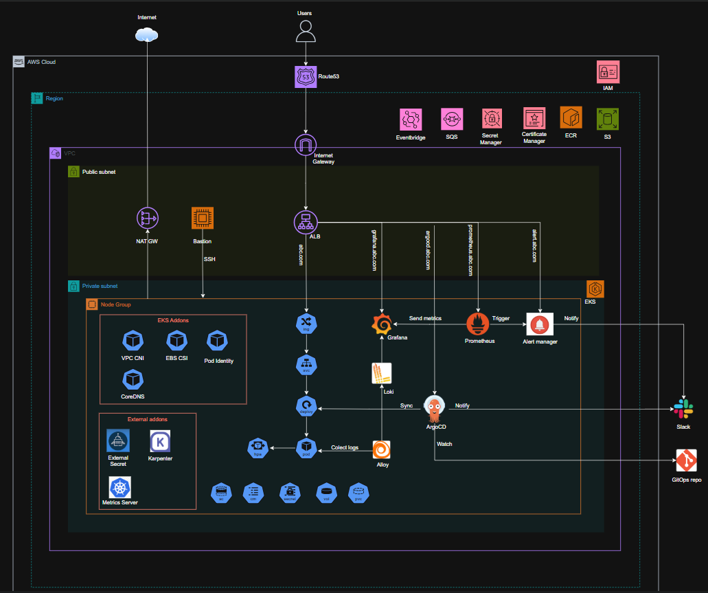
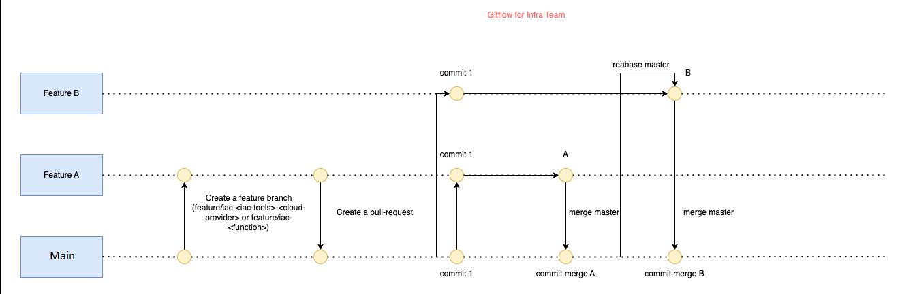

# AWS EKS Platform with Terraform

A comprehensive, production-ready Amazon EKS infrastructure built with Terraform, featuring advanced GitOps workflows, observability solutions, cost optimization, and security best practices.



## Platform Overview

This project implements a complete Kubernetes platform on AWS EKS with infrastructure-as-code principles, providing scalable, cost-effective, and secure container orchestration.

### Infrastructure as Code (IaC) Benefits

- **Cost Optimization**: Karpenter with mixed instance types (Spot + On-Demand) reduces infrastructure costs
- **Operational Excellence**: Automated deployments reduce errors and deployment time
- **Security**: Pod Identity and External Secrets ensure secure access to AWS services
- **Observability**: Complete logging and monitoring stack for production workloads
- **GitOps**: Declarative infrastructure and application management with ArgoCD

## Key Components

### 🚀 **Cost-Effective Auto Scaling**
- **Karpenter**: Smart node provisioning with cost optimization
  - **Spot Instances**: Up to 90% cost savings for fault-tolerant workloads
  - **On-Demand Instances**: Guaranteed capacity for critical applications
  - **Mixed Instance Types**: Automatic selection based on workload requirements
  - **Right-sizing**: Dynamic node sizing based on actual pod requirements

### 📊 **Comprehensive Observability**

#### Logging Stack
- **Grafana Loki**: Scalable log aggregation system
  - **S3 Storage**: Cost-effective long-term log retention with lifecycle policies
  - **Log Indexing**: Fast log queries with efficient indexing strategy
- **Grafana Alloy**: Advanced log processing and analytics
  - **Structured Logging**: JSON log parsing and enrichment
  - **Multi-tenant**: Isolated log streams per namespace/application

#### Monitoring & Alerting
- **Prometheus**: Metrics collection with service discovery
- **Grafana**: Rich dashboards and visualization
  - **Pre-built Dashboards**: Kubernetes, Loki, and application metrics
  - **Alert Visualization**: Real-time alert status and history
- **AlertManager**: Intelligent alert routing and notification
  - **Slack Integration**: Real-time alerts to dedicated channels

### 🔐 **Security & Secret Management**
- **External Secrets Operator**: AWS Secrets Manager integration
  - **Automatic Rotation**: Secrets are automatically rotated and updated
  - **Cross-Region**: Multi-region secret replication for disaster recovery
  - **Audit Logging**: Complete audit trail of secret access
- **Pod Identity**: AWS IAM authentication for pods
  - **Fine-grained Permissions**: Least-privilege access per workload
  - **No Shared Credentials**: Eliminates credential sharing between pods
  - **Temporary Credentials**: Short-lived tokens for enhanced security

### 🔄 **GitOps & Continuous Delivery**
- **ArgoCD**: Declarative continuous delivery
  - **Git as Source of Truth**: All configurations versioned in Git
  - **Slack Notifications**: Real-time sync status updates
    - ✅ **Sync Success**: Deployment completion notifications
    - ❌ **Sync Failed**: Immediate failure alerts with error details
    - ...
  - **Rollback Capabilities**: Quick rollback to previous known-good states

### 🌐 **Networking & Ingress**
- **AWS Load Balancer Controller**: Native AWS ALB integration
  - **SSL/TLS Termination**: Automatic certificate management
  - **Path-based Routing**: Advanced traffic routing capabilities
  - **Health Checks**: Intelligent health monitoring and failover

# IaC Experiences

## Cloud Platform

- [x] AWS

## Operation System (OS)

- [x] Ubuntu 20.04
- [x] MacOS

## IaC Tools

- [**Terraform**](https://developer.hashicorp.com/terraform/docs)

# How to do

## 1. Install

<details><summary>Ubuntu 20.04</summary><br>

```bash
sudo add-apt-repository ppa:xapienz/curl34
sudo apt update
sudo apt install -y libcurl4=7.68.0-1ubuntu2.5ppa1
sudo apt install -y unzip software-properties-common python3 python3-pip
python3 -m pip install --upgrade pip
curl -L "$(curl -s https://api.github.com/repos/terraform-docs/terraform-docs/releases/latest | grep -o -E -m 1 "https://.+?-linux-amd64.tar.gz")" > terraform-docs.tgz && tar -xzf terraform-docs.tgz terraform-docs && rm terraform-docs.tgz && chmod +x terraform-docs && sudo mv terraform-docs /usr/bin/
curl -L "$(curl -s https://api.github.com/repos/terraform-linters/tflint/releases/latest | grep -o -E -m 1 "https://.+?_linux_amd64.zip")" > tflint.zip && unzip tflint.zip && rm tflint.zip && sudo mv tflint /usr/bin/
wget -qO- https://raw.githubusercontent.com/nvm-sh/nvm/v0.39.2/install.sh | bash
nvm install node && nvm use node
npm install --save-dev @commitlint/{cli,config-conventional}
echo "module.exports = { extends: ['@commitlint/config-conventional'] };" > commitlint.config.js
wget https://dl.google.com/go/go1.20.1.linux-amd64.tar.gz
rm -rf /usr/local/go && tar -C /usr/local -xzf go1.20.1.linux-amd64.tar.gz && export PATH=$PATH:/usr/local/go/bin
go install github.com/git-chglog/git-chglog/cmd/git-chglog@0.9.1 && sudo cp ~/go/bin/git-chglog /usr/local/bin/
```

</details>

<details><summary>MacOS</summary><br>

```bash
brew install terraform-docs
brew install tflint
brew install go
brew install nvm
echo "source $(brew --prefix nvm)/nvm.sh" >> ~/.zshrc
nvm install node && nvm use node
npm install --save-dev @commitlint/{cli,config-conventional}
echo "module.exports = { extends: ['@commitlint/config-conventional'] };" > commitlint.config.js
go install github.com/git-chglog/git-chglog/cmd/git-chglog@0.9.1 && sudo cp ~/go/bin/git-chglog /usr/local/bin/
```

</details>

## 2. Setup

- pre-commit

  ```bash
  make pre-commit
  ```

- [aws-cli](https://github.com/framgia/celebhome_infra/blob/main/pre-terraform/README.md)

- [terraform](https://developer.hashicorp.com/terraform/downloads)

# Contributor

## Git flow

- Before **_add/change/deprecate/remove_** to this module, please checkout new branch like this `feature/<iac-tool>-<cloud-provider>` or `feature/<function>`

- Before **_fix_** to this module, please checkout new branch like this `bugfix/<iac-tool>-<cloud-provider>` or `bugfix/<function>`

- PR to `main` branch with [Commit Message Header](#commit-header) format.

- Follow our [Coding Rules](#rules).

### <a name="commit-header"></a>Commit Message Header

 ```
 <type>(<scope>): <short summary>
   │       │             │
   │       │             └─⫸ Summary in present tense. Not capitalized. No period at the end.
   │       │
   │       └─⫸ Commit Scope(Optional): terraform-aws-<terraform-module>-<function(optional)>
   │
   └─⫸ Commit Type: build|ci|docs|feat|fix|perf|refactor|test
 ```

Example:

- feat(terraform-aws-vpc): My description here
- docs(terraform-aws-vpc): cut the terraform-aws-vpc_vx.y.z release

#### Type

Must be one of the following:

- **docs**: Documentation only changes
- **feat**: A new feature
- **fix**: A bug fix
- **perf**: A code change that improves performance
- **refactor**: A code change that neither fixes a bug nor adds a feature
- **test**: Adding missing tests or correcting existing tests

#### Scope (Optional)

The scope should be the name of the module/feature affected

#### Summary

Use the summary field to provide a succinct description of the change:

- use the imperative, present tense: "change" not "changed" nor "changes"
- don't capitalize the first letter
- no dot (.) at the end

#### Revert commits

If the commit reverts a previous commit, it should begin with `revert:`, followed by the header of the reverted commit.

The content of the commit message body should contain:

- information about the SHA of the commit being reverted in the following format: `This reverts commit <SHA>`,
- a clear description of the reason for reverting the commit message.

#### <a name="rules"></a> Coding Rules

To ensure consistency throughout the source code, keep these rules in mind as you are working:

- All features or bug fixes **must be tested** by one or more apply.
- **must be documented**.

### Diagram GitFlow



## License

Apache 2 Licensed. See [LICENSE](/LICENSE) for full details.
