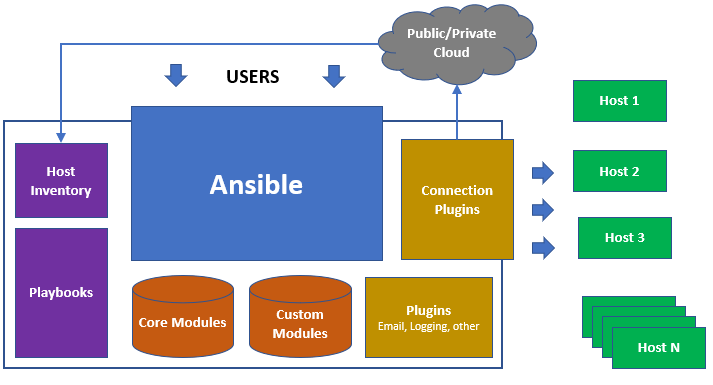

# DevOps: InfraAsCode (IaC) with Ansible

## Ansible Flow



## Group Vars

- Create all variables for all playbook
  - [x] all
  - [x] tag_Env_stg
  - [x] tag_Env_prod
  - [x] tag_Role_bastion

## Invertory

- Choose specific vars of group_vars for each environment
  - [x] staging
  - [x] production

## Roles
- **Bastion**
  - [x] base
  - [x] aws-cli
  - [x] hostname
  - [x] ssh-users
  - [x] cloudwatch
  - [x] ecs-exec

## Playbook

- Running playbook to install, configure tools and services
  - [x] playbook-bastion.yml

## Install Ansible & Config SSH

## 1. Install Ansible 

- Install the repository & install  ansible packages:

  ```bash
  sudo apt-get install software-properties-common
  sudo apt-add-repository --yes --update ppa:ansible/ansible
  sudo apt-get update
  sudo apt-get install ansible
  ```

## 2. Config ssh to server

- Add to ~/.ssh/config on PC running Ansible

  ```bash
  Host [Host_Name]
    HostName [Host_IP]
    User [User_Name]
    Port 22
    IdentityFile <path of ssh private key>
  ```

- Add to /etc/sudoers in inventory server

  ```bash
  [User_Name]  ALL=(ALL)  NOPASSWD: ALL
  ```

- Add ip public bastion server and path private key file to inventory/staging (Example: Running playbook-bastion.yml on staging enviroment) 

  ```bash
  [tag_Role_bastion]
  {{ip_public_bastion_staging}} ansible_ssh_private_key_file= {{path of private key file}}
  [tag_Env_stg:children]
  ```

## 3. Running playbook

### 3.1 Validate playbook before running

  ```bash
  ansible-playbook -D playbook-bastion.yml --check --diff
  ```

### 3.2 Running playbook to install (Example: staging enviroment)

  ```bash
  ansible-playbook -i inventory/staging playbook-bastion.yml
